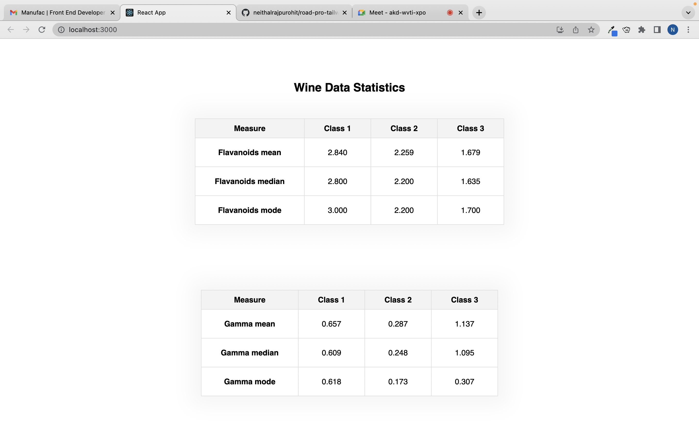

## Wine Data Statistics

### To run this project in your local system follow the steps

#### Step 1:

```
Clone this repo
```

#### Step 2:

```zsh
    cd react_task
    npm i or yarn
```

#### Step 3:

```zsh
    npm start or yarn start
```

#### Screenshot


